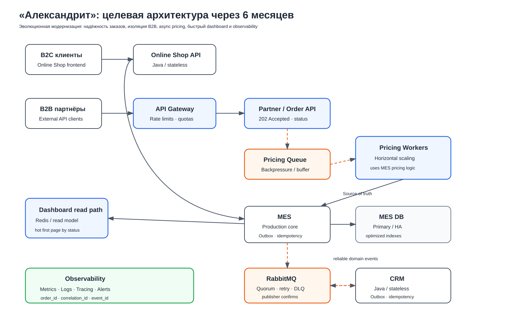
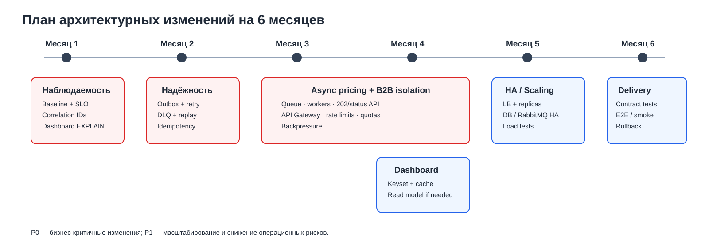

# Планирование: анализ, идентификация проблем и поиск решений

## 1. Общий анализ ситуации

Архитектура «Александрита» сформировалась при значительно меньшей нагрузке: Online Shop, CRM и MES работают по одному экземпляру, базы данных одновременно обслуживают чтение и запись, а длительный расчёт стоимости выполняется внутри MES.

После открытия B2B API нагрузка изменилась качественно: заказов стало больше, внешние клиенты начали создавать тяжёлые расчёты напрямую через MES, вырос поток сообщений между MES и CRM, а операторский dashboard стал конкурировать с транзакционной нагрузкой за те же ресурсы.

При этом производственные мощности, согласно условиям кейса, способны выдержать двукратный рост. Следовательно, главный риск находится не в физическом производстве, а в IT-контуре от приёма заказа до передачи его в производство.

Цель изменений на ближайшие полгода:

- не терять заказы и уметь восстановить их историю;
- изолировать B2B-нагрузку от core MES;
- вынести длительный pricing из синхронного HTTP-пути;
- ускорить работу операторов;
- убрать критические single points of failure;
- сделать систему наблюдаемой и безопаснее для дальнейшего роста.

---

## 2. Идентифицированные проблемы

### 2.1. Ненадёжная асинхронная обработка заказов между MES и CRM

B2B-заказ создаётся в CRM после сообщения от MES через RabbitMQ. В описании системы нет гарантий того, что одновременно реализованы transactional outbox, publisher confirms, durable/quorum queues, retry, DLQ и идемпотентность consumers.

**Последствия:** потеря или дублирование заказов, расхождение состояний MES и CRM, ручное восстановление данных, потеря клиентов и контрактов.

**Критичность: Critical / P0.**

### 2.2. Длительный pricing выполняется в контуре внешнего API и перегружает MES

Расчёт стоимости занимает обычно 2–3 минуты, а для сложных моделей — до 30 минут.
После открытия API MES одновременно обслуживает B2B-запросы, выполняет тяжёлые вычисления, обрабатывает заказы, обслуживает операторский dashboard и взаимодействует с CRM.

Синхронная обработка такого расчёта удерживает соединения и ресурсы приложения.
Отсутствие очереди и backpressure позволяет внешнему трафику непосредственно перегружать MES.

**Последствия:** timeouts, рост latency, исчерпание thread/connection pools, деградация dashboard, невозможность независимо масштабировать pricing.

**Критичность: Critical / P0.**

### 2.3. Внешний B2B API не изолирован от core MES

Сейчас MES фактически одновременно является производственной системой, calculation engine и внешней API-точкой.
Для B2B-трафика не описаны отдельные rate limits, quotas, throttling, ограничения размера/частоты запросов, backpressure и независимое масштабирование.

Один крупный партнёр или всплеск интеграционного трафика способен ухудшить работу внутренних операторов.

**Критичность: Critical / P0.**

### 2.4. Операторский dashboard создаёт тяжёлую read-нагрузку на MES DB

Фильтрация и пагинация уже добавлены, но это не решило проблему.

**Последствия:** медленный первый экран MES, лишняя нагрузка на DB CPU/connections, задержка взятия новых заказов в работу.

**Критичность: High / P0–P1.**

### 2.5. Система имеет single points of failure и ограниченно масштабируется

По одному экземпляру имеют Online Shop backend, CRM backend и MES backend; базы данных работают без отдельного read-path. Отказ или перегрузка одного экземпляра напрямую влияет на доступность бизнес-функции. Особенно критичен MES.

Необходимо также проверить HA-конфигурацию RabbitMQ и Managed DB.

**Критичность: High / P1.**

### 2.6. Недостаточная наблюдаемость и отсутствие сквозной корреляции заказа

Сейчас проблема обнаруживается в основном после жалобы клиента. Нет единого способа быстро ответить: где находится заказ и какой компонент последним успешно его обработал?

Нужно наблюдать не только CPU/RAM, но и бизнес-сигналы: зависшие заказы, время переходов между статусами, backlog очередей, DLQ, pricing duration.

**Критичность: High / P0.**

### 2.7. Не формализована модель переходов статусов заказа

Статусы изменяются в Online Shop, CRM и MES. Для распределённого процесса необходимо явно определить допустимые переходы, систему-владельца каждого перехода, `event_id`, версию события, timestamp, источник изменения и правила обработки повторного/устаревшего события.

**Критичность: High / P1.**

### 2.8. Релизный процесс плохо масштабируется вместе с системой

QA выполняет E2E вручную. С ростом числа интеграций увеличивается регрессия, а high/highest bugs задерживают релизы на недели.

Необходимо постепенно автоматизировать API tests, integration tests, contract tests MES ↔ CRM и producer ↔ consumer, critical E2E и smoke tests после deployment. Manual approval перед production можно сохранить.

**Критичность: Medium / P1–P2.**

---

## 3. Критерии приоритизации

Инициативы ранжируются по четырём критериям:

1. **Влияние на бизнес.** Потеря заказов и контрактов выше по приоритету, чем инфраструктурное удобство.
2. **Снижение риска.** Сначала устраняются механизмы, дающие потерять заказ без возможности восстановления.
3. **Зависимости.** Наблюдаемость и надёжный messaging нужны раньше масштабирования, иначе система станет больше, но останется непрозрачной.
4. **Стоимость и реализуемость.** Предпочтительны эволюционные изменения существующих Java/C# приложений, а не полный rewrite небольшой командой.

---

## 4. Инициативы и порядок реализации

| Приоритет | Инициатива | Что входит | Почему сейчас |
|---|---|---|---|
| P0 | Гарантированная обработка заказов | Transactional Outbox в системах-источниках событий, publisher confirms, durable/quorum queues, manual ack, retry/backoff, DLQ, idempotent consumers, replay | Компания уже теряет заказы |
| P0 | Асинхронный pricing | Job queue, `202 Accepted`, status API/webhook, отдельный worker pool, backpressure | Расчёт до 30 минут перегружает MES |
| P0 | Изоляция B2B API | API Gateway, Partner/Order API, rate limits, quotas, request limits | Внешняя нагрузка не должна влиять на операторов |
| P0 | Observability order flow | Metrics, structured logs, tracing, `order_id/correlation_id/event_id`, alerts на stuck orders/DLQ | Сейчас проблемы обнаруживают клиенты |
| P0–P1 | Оптимизация MES dashboard | `EXPLAIN`, composite indexes, keyset pagination, cache/read model | Операторы не видят новые заказы достаточно быстро |
| P1 | HA и горизонтальное масштабирование | Load balancer, несколько stateless instances, HA DB, RabbitMQ HA, autoscaling where useful | Устранение SPOF и запас на рост |
| P1 | Формализация order state machine | Владельцы статусов, допустимые переходы, versioning событий | Снижает риск рассинхронизации |
| P1–P2 | Автоматизация тестирования и delivery | Integration/contract/E2E/smoke, rollback; manual prod approval можно сохранить | Сокращает регрессию и задержки релиза |

### 4.1. Надёжный messaging

Изменение бизнес-сущности и запись события должны фиксироваться атомарно в локальной БД:

```text
BEGIN
UPDATE order ...
INSERT INTO outbox ...
COMMIT
```

Outbox publisher доставляет событие в RabbitMQ. Consumer выполняет операцию идемпотентно по `event_id`. После исчерпания retry сообщение попадает в DLQ, откуда доступен контролируемый replay.

**Важно:** Outbox нужен в каждой системе, которая является источником критичных событий, а не только в MES.

### 4.2. Асинхронный pricing

Внешний request не должен ждать завершения расчёта:

```text
POST order/model
      ↓
202 Accepted + job/order id
      ↓
Pricing Queue
      ↓
Scalable Workers
      ↓
MES pricing logic
      ↓
PriceCalculated event
```

Клиент получает статус через API или webhook. Очередь выступает буфером и создаёт backpressure.

### 4.3. Изоляция B2B API

В текущей архитектуре внешний API находится в MES. Целевое состояние:

```text
B2B Partner → API Gateway → Partner/Order API → Queue → Pricing Workers/MES
```

API Gateway применяет rate limits, quotas и ограничения запроса. Partner API принимает команду и не содержит производственную бизнес-логику MES.

### 4.4. Быстрый dashboard MES

Порядок действий:

1. снять baseline latency и DB load;
2. выполнить `EXPLAIN/EXPLAIN ANALYZE`;
3. добавить composite index под фактические filter/sort;
4. перейти на keyset pagination;
5. исключить N+1 и проверить connection pool;
6. для hot first page добавить server-side cache;
7. при дальнейшем росте — отдельную dashboard projection/read model.

Кеширование не должно маскировать неоптимальный SQL.

### 4.5. Наблюдаемость

Для критического пути заказа внедрить RED/USE и бизнес-метрики, structured logging, distributed tracing через OpenTelemetry, сквозные `order_id`, `correlation_id`, `event_id`, dashboards и alerts.

Ключевые сигналы: DLQ, oldest message age, queue depth, pricing duration, stuck orders, API error rate/latency, DB connections/query latency.

---

## 5. Целевая архитектура через полгода

Я не предлагаю полностью переписывать CRM и MES или разбивать их на множество микросервисов.
При текущем размере команды это создаст дополнительный migration risk в момент, когда бизнесу прежде всего нужны надёжность и предсказуемость.

Целевая архитектура должна эволюционно отделить внешнюю нагрузку и тяжёлый pricing от core MES, повысить надёжность сообщений и создать отдельный быстрый read-path для операторов.



Основные свойства:

- **Надёжность:** критичные события публикуются через Outbox, consumers идемпотентны, ошибки уходят в DLQ.
- **Асинхронность:** длительный pricing вынесен из HTTP request path.
- **Изоляция B2B:** внешний API защищён Gateway и не нагружает core MES напрямую.
- **Масштабирование:** stateless API/workers можно масштабировать горизонтально.
- **Быстрый read-path:** operator dashboard использует оптимизированный запрос и cache/read model.
- **Наблюдаемость:** один заказ можно проследить через API, RabbitMQ, MES и CRM по общим идентификаторам.
- **Отказоустойчивость:** убираются критичные single-instance точки, где это оправдано нагрузкой и стоимостью.

---

## 6. План на шесть месяцев



| Период | Основные работы | Ожидаемый результат |
|---|---|---|
| Месяц 1 | Baseline, monitoring, `order_id/correlation_id/event_id`, slow-query analysis, индексы MES dashboard, базовые SLO | Команда видит проблемы до массовых жалоб; dashboard получает быстрые локальные улучшения |
| Месяц 2 | Outbox, confirms, ack, retry/backoff, DLQ, idempotency, replay | Критичные события не теряются без следа |
| Месяцы 3–4 | Async pricing, queue, workers, `202 + status`, API Gateway/Partner API, rate limits | B2B traffic отделён от core MES, появляется backpressure |
| Месяц 4 | Keyset pagination, cache/read model для dashboard при необходимости | Операторы быстро видят новые заказы |
| Месяц 5 | Horizontal scaling, LB, HA DB/RabbitMQ, load/capacity tests | Устраняются SPOF и появляется запас по производительности |
| Месяц 6 | Integration/contract/E2E/smoke automation, rollback | Снижается регрессия и сокращается время выпуска исправлений |

План намеренно допускает параллельную работу: оптимизация dashboard не должна ждать завершения полной перестройки B2B-контура.

---

## 7. Если можно выполнить только три инициативы

### 1. Гарантированная доставка и идемпотентная обработка заказов

Включает Outbox, publisher confirms, acknowledgements, retry/backoff, DLQ, replay и идемпотентность consumers.

**Почему первая:** быстрая, но теряющая заказы система хуже медленной. Каждый принятый заказ должен либо быть обработан, либо оказаться в контролируемом состоянии ошибки, которое можно диагностировать и восстановить.

### 2. Асинхронный pricing + изоляция B2B API

Включает queue, worker pool, `202 Accepted`, status API/webhook, API Gateway, rate limits и backpressure.

**Почему вторая:** именно после открытия внешнего API резко выросла нагрузка. Эта инициатива устраняет длинные синхронные запросы и позволяет масштабировать pricing независимо от операторской части MES.

### 3. Разгрузка MES: быстрый dashboard + базовое горизонтальное масштабирование

Включает оптимизацию SQL/индексов, keyset pagination, cache/read model при необходимости и возможность запустить несколько экземпляров MES за load balancer.

**Почему третья:** даже гарантированно доставленный заказ бесполезен, если оператор слишком поздно его увидел или единственный MES instance стал bottleneck/SPOF.

Минимальные метрики и correlation IDs должны быть частью всех трёх инициатив как обязательное условие безопасного внедрения.

---

## 8. Почему не полный rewrite

Полный rewrite за шесть месяцев нецелесообразен:

- команда небольшая;
- MES написан на C#, при этом C#-экспертиза ограничена;
- MES содержит критичную бизнес-логику pricing;
- компания уже находится в ситуации потери заказов и контрактов;
- большой rewrite откладывает бизнес-эффект и создаёт новые migration risks.

Предпочтительный подход: **измерить → стабилизировать → обеспечить delivery guarantees → изолировать тяжёлую нагрузку → масштабировать → улучшать границы системы**.

Каждый этап должен давать самостоятельный измеримый результат.

---

## 9. Изменения в команде

Начать работу можно существующей командой:

- **Java backend:** Partner/Order API, integrations, Outbox в Java-системах;
- **C# developer + team lead:** MES, pricing workers/integration, Outbox и instrumentation MES;
- **DevOps:** RabbitMQ HA, observability, load balancing, autoscaling, CI/CD;
- **QA:** API/integration/contract/E2E automation;
- **Frontend:** async pricing UX и обновление состояния заказа.

Первый дополнительный найм — backend engineer с опытом distributed systems/messaging. Это уменьшит bus factor и ускорит наиболее критичные интеграционные изменения.

При росте production-инфраструктуры следующим наймом может быть второй DevOps/SRE.

---

## 10. Ожидаемый результат

Через полгода система должна обеспечивать:

- контролируемую доставку и повторную обработку событий;
- отсутствие «тихо потерянных» заказов;
- асинхронный и масштабируемый pricing;
- защиту MES от неконтролируемого B2B traffic;
- быстрый список новых заказов для операторов;
- трассируемый жизненный цикл заказа;
- отсутствие критичной зависимости от одного application instance;
- более быстрые и безопасные релизы.

Главный результат — рост количества заказов перестаёт приводить к пропорциональному росту инцидентов и жалоб клиентов.
