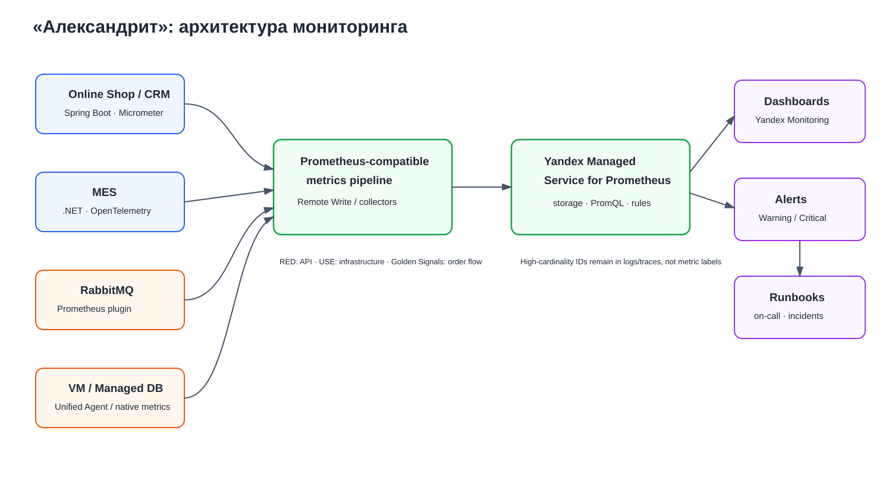

# Выбор и настройка мониторинга в системе

## 1. Мотивация

Яндекс Метрика показывает поведение пользователей интернет-магазина, но после открытия B2B API этого недостаточно: значительная часть заказов проходит через API, MES, RabbitMQ и CRM и не видна в веб-аналитике.

Мониторинг нужен, чтобы перейти от реактивного сценария:

```text
клиент пожаловался
        ↓
команда узнала о проблеме
        ↓
началось расследование
```

к проактивному:

```text
метрика вышла за допустимый диапазон
        ↓
сработал alert
        ↓
команда увидела деградацию
        ↓
проблема устраняется до массовых жалоб
```

Бизнес получает следующщие эффекты:

1. **Снижение риска потерянных и зависших заказов.** Можно отслеживать backlog RabbitMQ, DLQ, stuck orders и задержки переходов между статусами.
2. **Снижение MTTD и MTTR.** Команда быстрее понимает, какой класс компонента деградирует: API, MES, RabbitMQ или БД.
3. **Capacity planning.** Рост RPS, CPU, memory, DB connections и очередей позволяет масштабировать систему до возникновения инцидента.
4. **Контроль качества B2B/B2C-сервисов.** На основе измерений можно сформировать SLI/SLO по доступности, error rate, latency и времени прохождения заказа.

---

## 2. Выбор подхода к мониторингу

Для разных частей системы используются разные подходы.

### 2.1. RED — для API

Для Online Shop API, CRM API и MES API, включая текущие B2B endpoints MES, используется RED:

- **Rate** — количество запросов;
- **Errors** — количество/доля ошибочных запросов;
- **Duration** — продолжительность запросов.

После выделения отдельного Partner/Order API из MES те же RED-метрики должны применяться и к нему.

### 2.2. USE — для инфраструктуры

Для application instances, баз данных, RabbitMQ, thread pools и connection pools используется USE:

- **Utilization** — насколько активно используется ресурс;
- **Saturation** — есть ли очередь или ожидание ресурса;
- **Errors** — ошибки ресурса.

### 2.3. Четыре золотых сигнала — для end-to-end order flow

Для бизнес-процесса заказа используются:

- **Traffic:** количество создаваемых заказов;
- **Latency:** pricing duration, queue wait, время переходов между статусами, end-to-end duration;
- **Errors:** failed orders, pricing failures, DLQ;
- **Saturation:** queue depth, oldest message age, stuck orders, active workers.

## 3. Правила именования и labels

Для метрик используется единый базовый набор labels:

```text
environment="prod"
service="mes"
instance="mes-01"
```

Для HTTP:

```text
method="POST"
route="/orders/{id}"
status_class="2xx"
```

Для RabbitMQ:

```text
queue="orders"
vhost="production"
```

Для business metrics:

```text
source="b2b|b2c"
status="SUBMITTED"
```

## 4. Выбранные метрики

Пороговые значения ниже являются стартовыми. После 2–4 недель production-наблюдений и нагрузочного тестирования их необходимо скорректировать относительно baseline и согласованных SLO.

### 4.1. API и application instances

| Приоритет | Метрика | Пункты исходного списка | Зачем | Labels | Начальный alert |
|---|---|---:|---|---|---|
| P0 | `http_requests_total` / RPS | 3–5 | Нагрузка, пики, сравнение сервисов | environment, service, method, route, status_class | Аномальный рост относительно baseline |
| P0 | `http_request_duration_seconds` p50/p95/p99 | 19–21 | Выявление деградации API | environment, service, method, route | Warning: p95 > 1s; Critical: p95 > 3s для обычных endpoints |
| P0 | Error rate из `http_requests_total{status_class="5xx"}` | 28–30 | Доля серверных ошибок | environment, service, route | Warning >1% / 5m; Critical >5% / 5m |
| P1 | `http_requests_active` | 32–34 вместо sessions | Зависшие запросы, saturation thread pool/downstream | environment, service, instance | Порог после baseline |
| P0 | CPU utilisation | 9–11 | Перегрузка API/MES, влияние pricing | environment, service, instance | Warning >70% 10m; Critical >85% 10m |
| P0 | Memory utilisation | 12–14 | Memory pressure/OOM/leak | environment, service, instance | Warning >75%; Critical >90% |
| P1 | Runtime: GC, thread pool, DB pool | дополнительные | Диагностика JVM/.NET saturation | environment, service, instance | Порог по baseline |
| P2 | Network RX/TX | 35–40 | Capacity/anomaly diagnostics | environment, service, instance | Без paging-alert на первом этапе |
---

### 4.2. RabbitMQ

RabbitMQ критичен для интеграции MES ↔ CRM.

| Приоритет | Метрика | Пункт списка | Зачем | Labels | Начальный alert |
|---|---|---:|---|---|---|
| P0 | Queue depth (`messages ready`) | дополнительная | Видеть backlog необработанных событий | environment, vhost, queue | Порог по нормальному throughput |
| P0 | Messages unacked / in flight | 2 | Выявлять зависших/медленных consumers | environment, vhost, queue | Аномальный рост |
| P0 | DLQ queue depth | 1 | Необработанное событие может соответствовать реальному заказу | environment, vhost, queue | **Critical: >0** |
| P0 | Oldest/head message age | дополнительная | Показывает, как долго заказ реально ждёт обработки | environment, vhost, queue | Warning >1m; Critical >5m для MES→CRM |
| P0 | Consumer count | дополнительная | Обнаружить отсутствие consumers | environment, vhost, queue | Critical: 0 для critical queue |
| P1 | Publish/Ack/Redelivery rates | дополнительные | Видеть рост backlog и повторные доставки | environment, vhost, queue | Redelivery anomaly / published > acked продолжительное время |

---

### 4.3. Базы данных

| Приоритет | Метрика | Пункты списка | Зачем | Labels | Начальный alert |
|---|---|---:|---|---|---|
| P0 | DB connections / max connections | 17–18 | Connection saturation напрямую увеличивает latency | environment, database, host, role | Warning >70%; Critical >85% |
| P0 | Query latency p95/p99 | дополнительная | Найти медленный MES dashboard и другие slow queries | environment, database, query_name | Порог по SLO/baseline |
| P0 | CPU / memory | 15–16 + дополнительная CPU | Resource saturation | environment, database, host | Warning/Critical по baseline |
| P1 | Disk usage/free bytes | дополнительная | Не допустить исчерпания диска | environment, database, host | Warning >75%; Critical >85% |
| P1 | DB size | 23–24 | Capacity planning | environment, database | Trend, не paging-alert |
| P1 | Lock waits / waiting connections | дополнительные | Диагностика блокировок | environment, database | Аномальный рост |
| P1 | Replication lag | после появления replicas | Контроль актуальности read replica | environment, database, replica | Порог после выбора SLO |

Для dashboard query вместо полного SQL в label используется ограниченное имя:

```text
query_name="mes_dashboard_orders"
```

---

### 4.4. Object Storage

| Приоритет | Метрика | Пункт списка | Зачем | Labels | Alert |
|---|---|---:|---|---|---|
| P1 | Storage size | 22 | Capacity/cost planning для 3D-моделей | environment, bucket | Trend |
| P1 | Object count | дополнительная | Контроль роста объёма объектов | environment, bucket | Trend |
| P1 | Upload/download errors | дополнительная | Ошибки доступа к 3D-моделям | environment, bucket, operation | Аномальный error rate |

Object key не используется как label.

---

### 4.5. Бизнес-метрики заказа

| Приоритет | Метрика | Зачем | Labels | Начальный alert |
|---|---|---|---|---|
| P0 | `orders_created_total` | Реальный business traffic | environment, source | Аномальный рост/падение |
| P0 | `orders_current` | Видеть накопление заказов по статусам | environment, source, status | Рост конкретного статуса относительно baseline |
| P0 | `order_transition_duration_seconds` | Время между состояниями | environment, source, from_status, to_status | По SLO перехода |
| P0 | `price_calculation_duration_seconds` | Контроль тяжёлого расчёта | environment, source, result, complexity_bucket | Warning >30m; Critical >45m |
| P0 | `price_calculation_queue_wait_seconds` | Отличить ожидание worker от самого расчёта | environment, source | Warning p95 >5m; Critical >15m |
| P0 | `orders_failed_total` | Ошибки бизнес-процесса | environment, source, stage, error_type | Рост относительно baseline |
| P0 | `stuck_orders_current` | Сразу видеть зависшие заказы | environment, source, status | >0 для критичного перехода; порог зависит от status |
| P0 | `order_end_to_end_duration_seconds` | Контроль обещанного срока выполнения | environment, source | Warning для заказов, приближающихся к бизнес-дедлайну |

`error_type` и `complexity_bucket` имеют небольшой фиксированный набор значений. Полный exception и точное число полигонов в labels не помещаются.

---

## 6. Технологическая схема



Предлагаемый стек:

- **Java Spring Boot (Online Shop, CRM):** Micrometer / Prometheus endpoint;
- **.NET MES:** OpenTelemetry Metrics или Prometheus-compatible instrumentation;
- **RabbitMQ:** встроенный Prometheus plugin;
- **VM:** Unified Agent / Prometheus-compatible agent;
- **Managed DB / Yandex Cloud resources:** native Yandex Monitoring metrics;
- **центральное хранилище:** Yandex Managed Service for Prometheus;
- **визуализация и alerts:** Yandex Monitoring / Prometheus alerting rules.

Приложения экспортируют только агрегированные metrics; `order_id` и другие high-cardinality данные остаются в logs/traces.

---

## 7. Dashboards

Не требуется повторять весь каталог метрик на каждом dashboard. Представления разделяются по аудитории и задаче:

| Dashboard | Основной вопрос | Пользователи |
|---|---|---|
| Business / Orders | Не застревают ли заказы и соблюдаются ли сроки? | Product, support, sales, team lead |
| MES / APIs | Деградируют ли API и MES? | Engineering, DevOps |
| RabbitMQ | Есть ли backlog, DLQ или проблемы consumers? | Engineering, DevOps |
| Databases | Является ли БД bottleneck? | Engineering, DevOps |
| B2B API | Не создаёт ли внешний трафик перегрузку/ошибки? | Product, engineering |

---

## 8. План действий

### Этап 1. Зафиксировать baseline и SLI/SLO

Определить вместе с бизнесом:

- доступность API;
- допустимый 5xx rate;
- p95 latency обычных endpoints;
- максимальное время ключевых переходов заказа;
- допустимое время queue wait;
- бизнес-дедлайн выполнения заказа.

### Этап 2. Развернуть центральный metrics pipeline

Создать Yandex Managed Service for Prometheus workspace, настроить Remote Write/agents, retention, environments и naming/labels conventions.

### Этап 3. Инструментировать критический путь

Первая очередь:

```text
MES API + MES runtime
RabbitMQ
MES DB
CRM API
B2B endpoints MES
business order metrics
```

Вторая очередь:

```text
Online Shop
Object Storage
остальные infrastructure/runtime metrics
```

### Этап 4. Создать dashboards

Минимум:

- Business/Orders;
- MES/APIs;
- RabbitMQ;
- Databases;
- B2B.

### Этап 5. Настроить alerts и runbooks

Для каждого Critical alert определить:

- значение и окно;
- notification channel;
- ответственного;
- dashboard/log/trace link;
- шаги диагностики;
- условия эскалации.

### Этап 6. Провести нагрузочное тестирование и откалибровать thresholds

Через 2–4 недели production-наблюдений пересмотреть первоначальные thresholds относительно реального baseline.

---

## 9. Показатели насыщенности и реакция системы

Это дополнительная часть задания. Значения являются стартовыми, а не универсальными константами.

| Сигнал | Warning | Critical | Реакция |
|---|---:|---:|---|
| Application CPU | >70% 10m | >85% 10m | Проверить RPS/latency; scale только после подтверждения capacity-проблемы |
| Application memory | >75% | >90% | Проверить leak/GC; при необходимости restart/scale/upsize |
| DB connections | >70% | >85% | Проверить pool/leak/slow transactions; не увеличивать max connections автоматически |
| DB disk | >75% | >85% | Проверить growth/retention, расширить storage |
| API 5xx rate | >1% / 5m | >5% / 5m | Warning в командный канал; Critical → incident/on-call/rollback if release-related |
| API p95 latency | >1s | >3s | Проверить DB/downstreams/runtime saturation |
| DLQ queue depth | — | >0 | Incident → определить event → исправить причину → controlled replay |
| Critical queue consumers | — | 0 | Проверить deployment/instances, restart or scale |
| MES→CRM oldest message age | >1m | >5m | Проверить consumers, CRM, DB latency; scale consumers при capacity-причине |
| Pricing queue wait p95 | >5m | >15m | Scale workers / apply backpressure / ограничить B2B rate |
| Price calculation duration | >30m | >45m | Проверить worker, CPU/RAM и сложность модели |
| Stuck order | По SLO статуса | Нарушение критического SLO | Engineering + support/product, если затронут клиентский срок |

### Severity policy

- **Warning:** уведомление команды; тикет, если состояние сохраняется.
- **Critical technical:** on-call + incident + runbook.
- **Critical business:** engineering + product/support, поскольку возможна потеря заказа или нарушение клиентского срока.

Автоматическое масштабирование применяется только к компонентам, для которых оно действительно настроено и проверено нагрузочным тестированием; alert сам по себе не должен безусловно менять инфраструктуру.

---

## 10. Приоритет внедрения

### P0

- RabbitMQ DLQ, queue depth, oldest message age, consumers;
- orders created/failed/current/stuck;
- price calculation duration и queue wait;
- API RPS/error rate/latency;
- MES CPU/memory;
- MES DB connections/query latency.

### P1

- остальные DB/runtime metrics;
- Object Storage;
- расширенные dashboards;
- replication lag после появления replicas.

### P2

- network/cost metrics;
- long-term forecasting;
- anomaly detection после накопления baseline.

---

## 11. Ожидаемый результат

После внедрения мониторинга команда должна быстро отвечать на пять вопросов:

1. Доступны ли критические API и не вырос ли error rate/latency?
2. Перегружены ли MES или его БД?
3. Растёт ли RabbitMQ backlog, есть ли DLQ и работающие consumers?
4. На каком статусе накапливаются или зависают заказы?
5. Есть ли риск нарушения обещанного клиенту срока?

Цель мониторинга — не максимальное количество графиков, а раннее обнаружение деградации и снижение числа ситуаций, когда компания впервые узнаёт о проблеме от клиента.
