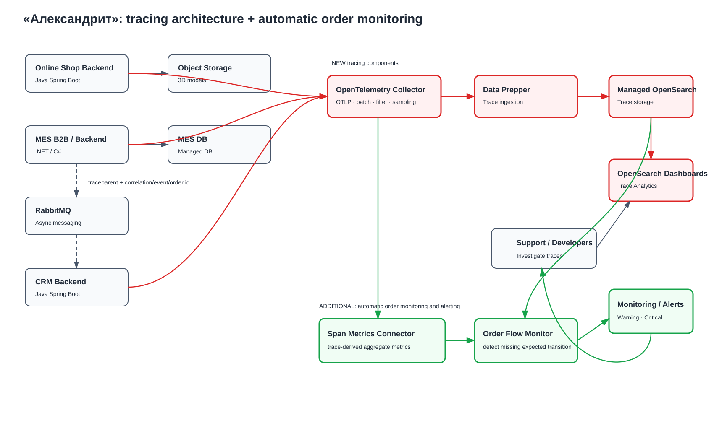

# Архитектурное решение по трейсингу

## 1. Анализ системы и область покрытия

Заказ проходит через несколько приложений и асинхронных интеграций. В текущей архитектуре B2B API находится в MES, поэтому отдельный `Partner API` здесь не считается существующим компонентом. Если он будет выделен согласно целевой архитектуре Task1, к нему применяются те же правила tracing.

Критический путь заказа:

```text
Online Shop / B2B client
        ↓
       MES
        ↓
    RabbitMQ
        ↓
       CRM
        ↓
       MES
        ↓
      CRM
```

Заказ может «сломаться» или зависнуть
-- на границе HTTP-вызова
-- при длительном расчёте стоимости
-- при публикации/получении сообщения RabbitMQ
-- при обращении к БД или Object Storage
-- при вызове внешней транспортной компании.

### 1.1. Какие системы покрываются tracing

| Компонент | Что трассируем | Где возможна проблема |
|---|---|---|
| Online Shop Backend | Создание заказа, `SUBMITTED`, вызов MES, upload/read 3D-модели | timeout, ошибка MES/Object Storage, дальнейшая обработка не началась |
| MES B2B/API + MES Backend | Приём B2B/B2C заказа, pricing, изменение статусов, DB calls, publish/consume RabbitMQ | долгий pricing, timeout, ошибка БД, событие не опубликовано/не обработано |
| RabbitMQ integration | producer span, message headers, consumer span, retry/redelivery | сообщение задержалось, повторно доставлено или consumer завершился ошибкой |
| CRM Backend | Создание заказа из сообщения MES, `MANUFACTURING_APPROVED`, `CLOSED`, отправка команд MES | ошибка consumer/DB, статус не изменился |
| Object Storage | Client spans со стороны Shop/MES для upload/download/read | 3D-файл недоступен или операция занимает слишком долго |
| Внешняя транспортная компания | Outbound request и inbound callback на нашей стороне | timeout, 4xx/5xx, callback не получен |

### 1.2. Критичные переходы заказа

Особого контроля требуют:

```text
SUBMITTED → PRICE_CALCULATED
```

потому что pricing может занимать до 30 минут, и:

```text
PRICE_CALCULATED → MANUFACTURING_APPROVED
```

потому что здесь участвует асинхронная интеграция MES → RabbitMQ → CRM.

Также важно контролировать переход:

```text
MANUFACTURING_APPROVED → MANUFACTURING_STARTED
```

так как длительная задержка на этом этапе напрямую влияет на сроки производства.

---

## 2. Данные, которые должны попадать в tracing

### 2.1. Атрибуты

Для каждого span:

```text
trace_id
span_id
parent_span_id
service.name
service.version
deployment.environment
span.name
start_time
end_time
duration
status
error.type
```

Для HTTP:

```text
http.request.method
http.route
http.response.status_code
server.address
```

Для messaging:

```text
messaging.system = rabbitmq
messaging.destination.name
messaging.operation
messaging.message.id
```

### 2.2. Бизнес-атрибуты

Для связи tracing с жизненным циклом заказа:

```text
order.id
correlation.id
event.id
order.source = b2b | b2c
order.status.from
order.status.to
retry.count
```

### 2.3. Корреляция долгого бизнес-процесса

Один заказ может обрабатываться несколько недель, поэтому один OpenTelemetry trace на весь жизненный цикл заказа не создаётся.

Используются два уровня:

**Технический trace** — одна связанная операция, например:

```text
HTTP request → MES → DB → RabbitMQ publish
```

или:

```text
RabbitMQ consume → CRM → DB
```

**Business correlation** — все traces одного заказа связываются через:

```text
order.id
correlation.id
event.id
```

Таким образом по `order.id` можно восстановить цепочку отдельных технических traces за весь жизненный цикл заказа.

---

## 3. Мотивация

Сейчас команда часто узнаёт о проблеме после обращения клиента и вручную проверяет несколько систем. Distributed tracing позволяет быстро локализовать технический участок, на котором возникла ошибка или задержка.

### Метрики, на которые повлияет внедрение tracing

| Показатель | Ожидаемый эффект |
|---|---|
| MTTD | Сокращается время обнаружения проблемного участка |
| MTTR | Сокращается время диагностики и восстановления |
| Среднее время обработки обращения support | Уменьшается за счёт поиска по `order.id`/`trace_id` |
| Время обнаружения stuck order | Уменьшается при автоматическом анализе trace-derived signals |
| Trace coverage критического order flow | Цель первой итерации — максимально полное покрытие ключевых переходов |

---

## 4. Предлагаемое решение

Используется стандарт **OpenTelemetry**, чтобы не привязывать instrumentation приложений к конкретному tracing backend.

Общая схема:

```text
Java / .NET applications
        ↓ OTLP
OpenTelemetry Collector
        ↓
Data Prepper
        ↓
Managed OpenSearch
        ↓
OpenSearch Dashboards / Trace Analytics
```

### 4.1. Инструментирование приложений

| Компонент | Инструментирование |
|---|---|
| Online Shop / CRM (Java) | OpenTelemetry Java Agent/SDK: HTTP, JDBC, RabbitMQ client + manual business spans |
| MES (.NET) | OpenTelemetry .NET: ASP.NET, HttpClient, DB client, RabbitMQ + manual pricing/status spans |
| RabbitMQ | Propagation W3C Trace Context через message headers |
| Object Storage / external HTTP | Client spans в вызывающем приложении |

 Spans:

```text
order.submit
order.calculate_price
order.approve_manufacturing
order.start_manufacturing
order.complete_manufacturing
order.ship
order.close
```

### 4.2. Trace context через RabbitMQ

В message headers передаются стандартные W3C-поля:

```text
traceparent
tracestate
```

Для business correlation дополнительно:

```text
x-correlation-id
x-event-id
x-order-id
```

Producer создаёт span публикации. Consumer извлекает context и создаёт consumer span. Это позволяет связать синхронный и асинхронный участки обработки.

### 4.3. OpenTelemetry Collector

Collector размещается во внутренней сети и используется как единая точка приёма telemetry.

Функции:

- OTLP receiver;
- batching;
- filtering/redaction;
- sampling;
- export traces в Data Prepper/OpenSearch;
- при необходимости формирование trace-derived metrics.

Приложения не должны напрямую писать в OpenSearch.

### 4.4. Хранилище и визуализация

Tracing data хранится в Managed OpenSearch. Data Prepper подготавливает данные для Trace Analytics.

В OpenSearch Dashboards должны быть доступны:

- поиск по `trace_id`;
- поиск traces по `order.id`/`correlation.id`;
- service map;
- error spans;
- duration/latency;
- переход от trace к связанным logs по `trace_id`/`span_id`.

### 4.5. Sampling

На первом этапе для критического order flow предпочтительно высокое покрытие, чтобы понять реальные причины инцидентов.

Предлагаю стратегия:

```text
error traces             → 100%
очень медленные traces   → 100%
критический B2B flow     → 100% на этапе внедрения
обычные успешные traces  → sampling после оценки объёма
```

Sampling применяется к техническим traces. Business correlation (`order.id`) не должна зависеть от одного многонедельного trace.

---

## 5. C4-диаграмма tracing



[Исходник диаграммы Draw.io](./alexandrite-tracing-alerting.drawio)

На схеме добавлены:

- OpenTelemetry Collector;
- Data Prepper;
- Managed OpenSearch;
- OpenSearch Dashboards;
- связи OTLP от Online Shop, MES и CRM;
- propagation trace context через RabbitMQ;
- доступ support/developers к Trace Analytics.

---

## 6. Автоматический контроль прохождения заказа и alerting

Дополнительное задание реализуется поверх tracing, но не требует постоянно вручную открывать traces.

Новые элементы на схеме выделены **зелёным**.


[Исходник диаграммы Draw.io](./alexandrite-tracing-alerting.drawio)

### 6.1. Trace-derived metrics

Из spans формируются низкокардинальные агрегированные metrics:

```text
order_transition_duration_seconds
trace_errors_total
service_dependency_errors_total
```

Order Flow Monitor периодически проверяет, что после события/trace перехода появился ожидаемый следующий этап в пределах SLO.

Пример:

```text
SUBMITTED → PRICE_CALCULATED
```

## 7. Компромиссы

### 7.1. Стоимость хранения

Tracing генерирует большой объём telemetry. Стоимость зависит от RPS, количества spans, attributes, sampling и retention.

Поэтому 100% успешных traces не следует хранить бессрочно. Sampling и retention настраиваются после измерения реального объёма.

### 7.2. Tracing не заменяет надёжность messaging

Trace может показать, что операция публикации/обработки завершилась ошибкой, но сам не гарантирует доставку.

Для этого по-прежнему нужны:

- Transactional Outbox;
- publisher confirms;
- retry/backoff;
- DLQ;
- idempotency.

### 7.3. Ограничения внешних систем

Если транспортная компания не поддерживает W3C Trace Context, внутри её системы trace продолжить невозможно. Мы видим только собственный outbound call и входящий callback.

### 7.4. Legacy MES и стоимость instrumentation

Исходный код MES доступен, но у команды ограничена C#-экспертиза. Поэтому сначала инструментируются:

- HTTP;
- DB;
- RabbitMQ;
- pricing;
- ключевые status transitions.

Подробные внутренние spans добавляются только там, где они реально помогают расследованию.

## 8. Безопасность

### 8.1. Доступ

Tracing backend и Collector размещаются во внутренней сети. Прямой доступ из Internet запрещён.

Для пользователей:

- корпоративная учётная запись;
- SSO/IAM;
- MFA;
- RBAC.

Пример ролей:

| Роль | Права |
|---|---|
| Support | Read traces и поиск по order/correlation id |
| Developer | Read traces, service map, saved queries |
| Team Lead / SRE | Read + dashboards/configuration |
| Administrator | Security/configuration management |

### 8.2. Защита данных

В traces запрещено помещать:

- ФИО, телефон, email и адрес доставки;
- платёжные данные;
- access/refresh tokens;
- Authorization/Cookie headers;
- пароли и credentials RabbitMQ/DB;
- содержимое 3D-моделей;
- полные request/response bodies.

Для investigation используются технические и псевдонимизированные identifiers:

```text
order.id
correlation.id
event.id
trace_id
```

Collector дополнительно выполняет filtering/redaction запрещённых attributes.

### 8.3. Передача и аудит

- OTLP и доступ к OpenSearch — по TLS;
- Security Groups разрешают только необходимые связи;
- service accounts используют least privilege;
- логируются входы, изменения прав и административные операции tracing backend.

---

## 9. Приоритет внедрения

### Первая очередь

Наиболее критичные сценарий и интеграции:
```text
MES B2B/API
MES Backend
RabbitMQ integration
CRM Backend
```

### Вторая очередь

```text
Online Shop Backend
Object Storage client operations
external delivery integration
```

## 10. Ожидаемый результат

После внедрения tracing команда должна иметь возможность:

1. по `order.id` найти относящиеся к заказу technical traces;
2. определить последний успешно завершённый этап;
3. увидеть latency и error span конкретного service boundary;
4. связать HTTP и RabbitMQ участки через trace context;
5. перейти от trace к связанным logs;
6. автоматически получать alert, если ожидаемый переход заказа не произошёл в пределах SLO.

Главный результат — расследование заказа перестаёт строиться со слов клиента и превращается в воспроизводимую техническую историю.
