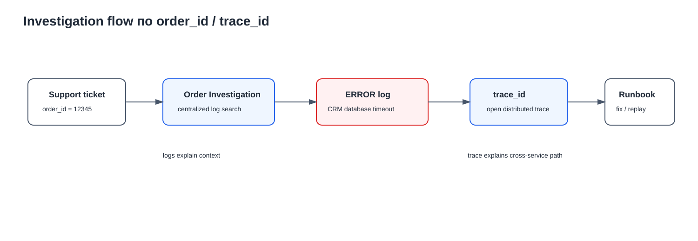
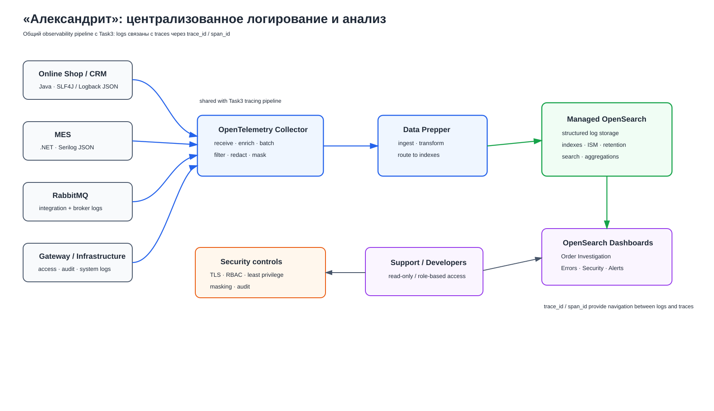

# Архитектурное решение по логированию

## 1. Анализ системы и область логирования

Сейчас расследование проблем в «Александрите» часто начинается со слов клиента. Разработчикам и support приходится вручную проверять несколько систем, чтобы восстановить последовательность событий заказа.

Цель решения — создать централизованное structured logging, в котором события можно искать по техническим и бизнес-идентификаторам и связывать с tracing из Task3.

Ключевые идентификаторы:

```text
trace_id
span_id
correlation_id
order_id
event_id
```

### 1.1. Какие системы должны отправлять логи

| Компонент | Что собираем | Приоритет |
|---|---|---|
| MES B2B/API и MES Backend | Приём заказа, pricing, status transitions, publish/consume RabbitMQ, ошибки DB/Object Storage | P0 |
| CRM Backend | Создание заказа из события, изменения статуса, consumer errors, DB errors | P0 |
| RabbitMQ integration | Publish/consume result, retry/redelivery, DLQ processing; broker/system logs — отдельно | P0 |
| Online Shop Backend | Создание/отправка заказа, работа с 3D-моделью, вызовы MES | P1 |
| API Gateway / Load Balancer | Access logs, status, latency, rate-limit events | P1 после выделения/использования Gateway |
| Object Storage access | Ошибки upload/download/read на стороне приложения и доступные audit/access logs | P1 |
| OpenTelemetry Collector / Data Prepper / OpenSearch | Технические и audit logs observability-контура | P1 |

---

## 2. Формат и состав логов

Application logs должны быть **structured JSON**.

Пример:

```json
{
  "timestamp": "2026-09-13T08:15:32Z",
  "level": "INFO",
  "service": "mes",
  "environment": "prod",
  "service_version": "2.14.1",
  "trace_id": "4bf92f...",
  "span_id": "00f067...",
  "correlation_id": "corr-123",
  "order_id": "12345",
  "event_id": "evt-456",
  "operation": "price_calculation_completed",
  "order_status_from": "SUBMITTED",
  "order_status_to": "PRICE_CALCULATED",
  "duration_ms": 175240,
  "result": "success"
}
```

### 2.1. Базовые поля

Для application logs предлагаю:

```text
timestamp
level
service
environment
service_version
operation
result
```

Для корреляции:

```text
trace_id
span_id
correlation_id
order_id
event_id
```

Для ошибок:

```text
error.type
error.code
error.message
stacktrace
```

`error.message` и `stacktrace` проходят masking/filtering до отправки в централизованное хранилище.

---

## 3. INFO-события

INFO используется для значимых нормальных событий бизнес-процесса. Не нужно логировать на INFO каждый вызов внутреннего метода.

| Система | INFO-событие | Основные поля |
|---|---|---|
| Online Shop | Создан заказ | order_id, source, correlation_id |
| Online Shop | 3D-модель принята/загружена | order_id, file_id, size, result |
| Online Shop | Заказ переведён в `SUBMITTED` | order_id, old_status, new_status |
| MES B2B/API | B2B-заказ принят | order_id, source, correlation_id |
| MES | Pricing started | order_id, calculation_id |
| MES | Pricing completed | order_id, calculation_id, duration_ms, result |
| MES/CRM | Изменён статус заказа | order_id, old_status, new_status, event_id |
| MES producer | Событие подготовлено/опубликовано | order_id, event_id, destination, result |
| CRM/MES consumer | Событие обработано | order_id, event_id, destination, result, retry_count |
| CRM | Заказ создан из входящего события | order_id, event_id |
| MES | Производство начато/завершено | order_id, old_status, new_status |
| MES | Заказ упакован/отправлен | order_id, old_status, new_status |
| CRM | Заказ закрыт | order_id, old_status, new_status |
| Application | Приложение стартовало | service, environment, service_version |

Для статусов лучше использовать однотипное событие `order_status_changed`, а не создавать отдельный формат лога для каждого статуса.

---

## 4. Уровни логирования

| Уровень | Когда используется | Примеры |
|---|---|---|
| DEBUG | Детальная диагностика; в production по умолчанию выключен и включается временно | внутренние стадии расчёта, детали serialization, клиент RabbitMQ |
| INFO | Нормальное значимое бизнес-/service-событие | заказ создан, pricing завершён, статус изменён, event обработан |
| WARN | Операция продолжилась, но есть отклонение | retry, slow operation, rate limit, temporary external error |
| ERROR | Операция не выполнена или бизнес-событие обработано с ошибкой | DB error, message processing failed, pricing failed, HTTP 5xx |
| FATAL/CRITICAL | Процесс не может корректно продолжать работу | invalid configuration, приложение не может стартовать |

---

## 5. Мотивация

Централизованное logging позволяет искать историю по `order_id`, `event_id`, `trace_id` и `service`, а не собирать её вручную с нескольких серверов.

Пример расследования:

```text
10:01 MES   pricing completed
10:01 MES   event published
10:01 CRM   event received
10:01 CRM   ERROR database timeout
```



### Показатели, на которые должно повлиять решение

| Показатель | Ожидаемый эффект |
|---|---|
| MTTR | Снижается за счёт централизованного поиска |
| Среднее время обработки обращения support | Снижается благодаря поиску по `order_id` |
| Доля обращений, требующих подключения разработчика | Снижается: support получает безопасный read-only поиск |
| Доля заказов с восстанавливаемой технической историей | Растёт благодаря единым structured events |
| Количество повторяющихся production incidents | Снижается после агрегации ошибок и поиска повторяющихся signatures |

### Приоритет внедрения tracing и logging

Тк команда огначиены в ресурсах то предлагаю разбить введение по приоритетам

**P0:**
```text
MES B2B/API → MES → RabbitMQ → CRM
```

**P1:**
```text
Online Shop → Object Storage → external integrations
```

## 6. Предлагаемое решение

Для logging переиспользуется observability pipeline из Задачи 3:

```text
Applications / infrastructure logs
            ↓
OpenTelemetry Collector
            ↓
Data Prepper
            ↓
Yandex Managed Service for OpenSearch
            ↓
OpenSearch Dashboards
```

### 6.1. Сбор логов

- **Java (Online Shop, CRM):** SLF4J + Logback с JSON encoder.
- **.NET MES:** Serilog с JSON output/enrichment.
- **OpenTelemetry Collector:** приём, enrichment, filtering/redaction, batching и forwarding.
- **Data Prepper:** ingestion/transformation перед OpenSearch.
- **RabbitMQ/system logs:** через совместимый log receiver/agent в тот же pipeline.

Приложение не должно напрямую писать в OpenSearch.

### 6.2. Корреляция с tracing

Каждый log внутри активного span получает:

```text
trace_id
span_id
```

Business events дополнительно получают:

```text
order_id
correlation_id
event_id
```

### 6.3. Архитектурная схема



[Исходник диаграммы Draw.io](./alexandrite-logging.drawio)

---

## 7. Политика безопасности

### 7.1. Какие данные запрещено логировать

Запрещено сохранять:

- passwords;
- access/refresh tokens;
- Authorization headers;
- cookies/session secrets;
- CVV/полные платёжные реквизиты;
- connection strings с credentials;
- содержимое 3D-файлов;
- полные request/response bodies;
- персональные данные, если они не нужны для расследования.

### 7.2. Доступ

OpenSearch/Data Prepper располагаются в private network; прямой доступ из Internet запрещён.

Используются TLS, корпоративная/federated authentication, MFA, RBAC, service accounts с least privilege и audit logging.

| Роль | Доступ |
|---|---|
| Support | Read production application logs по разрешённым индексам |
| Developer | Read logs, saved searches/dashboards |
| Team Lead / SRE | Read + dashboards/alerts/index policies |
| Administrator | Security и cluster configuration |
| Collector/Data Prepper service account | Только необходимые write/ingest permissions |

---

## 8. Политика хранения и индексов

Не следует помещать все окружения и сервисы в один бесконечный индекс.

```text
logs-prod-mes-*
logs-prod-crm-*
logs-prod-shop-*
logs-prod-rabbitmq-*
logs-release-*
logs-dev-*
security-prod-*
audit-prod-*
```

### 8.1. Retention

| Тип логов | Начальный retention | Причина |
|---|---:|---|
| DEV | 7 дней | Короткий цикл диагностики |
| RELEASE | 14 дней | Проверка release/regression |
| PROD application | 30 дней | Покрывает типичный жизненный цикл заказа около 3 недель и даёт запас |
| Security | 90 дней | Расследование security events |
| Audit access/admin | 180 дней | Контроль административных действий |

Retention уточняется после оценки требований бизнеса/compliance и фактической стоимости хранения.

## 9. Система анализа логов

Просто собрать logs недостаточно. Нужны saved searches, dashboards, alerts и при необходимости anomaly detection.

Не следует дублировать metric-based alerts из Задачи 2.
Например, основной alert на API p95 или CPU остаётся в monitoring.
Log-based alert полезен там, где важен тип или контекст события.

### 9.1. Saved searches и dashboards

| Use case | Фильтр / представление |
|---|---|
| История заказа | `order_id="12345"` |
| Ошибка конкретного trace | `trace_id="..."` |
| Production errors MES | `service="mes" AND level="ERROR"` |
| Message processing failures | `operation="message_consume" AND result="failed"` |
| Повторные доставки | `retry_count > 0` |
| Security events | authentication/authorization failures |

Основные dashboards:

- **Order Investigation** — `order_id`, `correlation_id`, `trace_id`, service, time range;
- **Production Errors** — ошибки по service/type/version, retries, top error signatures;
- **Security / Access** — auth failures и административные события.

## 10. Выбор технологии

| Критерий | OpenSearch | Elasticsearch | Grafana Loki | Splunk |
|---|---|---|---|---|
| Модель лицензирования | Open-source, Apache 2.0 | Несколько вариантов лицензирования; часть возможностей коммерческая | Open-source | Proprietary |
| Full-text поиск | Сильный | Сильный | Не основной сценарий; оптимизирован под label-based log search | Сильный |
| Structured JSON / fields | Да | Да | Да | Да |
| Aggregations | Да | Да | Да, но иной подход | Да |
| Dashboards | OpenSearch Dashboards | Kibana | Grafana | Splunk UI |
| Alerting | Да | Да | Через Grafana stack | Да |
| Anomaly detection | Есть соответствующие возможности/plugins | Есть | Обычно через Grafana/внешние компоненты | Есть |
| Связь с tracing | Хорошо сочетается с OTel/Data Prepper и Задачей 3 | Возможна через Elastic stack | Обычно Loki + Tempo | Splunk Observability |
| Managed вариант в текущем Yandex Cloud | **Есть Managed Service for OpenSearch** | Потребуется иной deployment/managed вариант | Потребуется отдельный deployment | External/commercial service |
| Согласованность с Задачей 3 | **Высокая** | Потребует смены backend | Потребует отдельного tracing backend | Потребует отдельного commercial stack |

### Выбор

Для проекта выбирается **Yandex Managed Service for OpenSearch**, потому что:

1. тот же backend уже используется в Task3 для tracing;
2. есть Managed Service в текущем Yandex Cloud;
3. поддерживает structured search, aggregations и Dashboards;
4. позволяет построить единый investigation flow `trace ↔ logs`;
5. команда не получает ещё один самостоятельный observability stack.

---

## 11. План внедрения

### Этап 1. Logging contract

Зафиксировать JSON schema, обязательные поля, naming convention, правила levels, masking/redaction и correlation IDs.

### Этап 2. P0-системы

```text
MES B2B/API
MES Backend
RabbitMQ integrations
CRM Backend
```

### Этап 3. Централизованный pipeline

```text
OpenTelemetry Collector
→ Data Prepper
→ Managed OpenSearch
→ OpenSearch Dashboards
```

### Этап 4. Security и lifecycle

Настроить RBAC, service accounts, TLS, index templates, rollover/ISM, retention и audit.

### Этап 5. Анализ

Создать Order Investigation, Production Errors, security saved searches, log-based alerts и runbooks.

### Этап 6. Расширение

Подключить Online Shop, Object Storage access, API Gateway и external integrations. Anomaly detection включать после накопления baseline.

---

## 12. Ожидаемый результат

После внедрения команда сможет по `order_id` или `trace_id` за несколько минут:

1. найти связанные события всех покрытых сервисов;
2. увидеть последовательность изменения статусов;
3. определить, какое событие было опубликовано и обработано;
4. найти ERROR/WARN и связанный stacktrace;
5. перейти из log к trace и обратно;
6. определить повторяющийся production pattern, а не расследовать каждый случай отдельно.

Главный результат — расследование перестаёт зависеть от рассказа клиента и ручного поиска по серверам, а становится воспроизводимым и контролируемым процессом.
