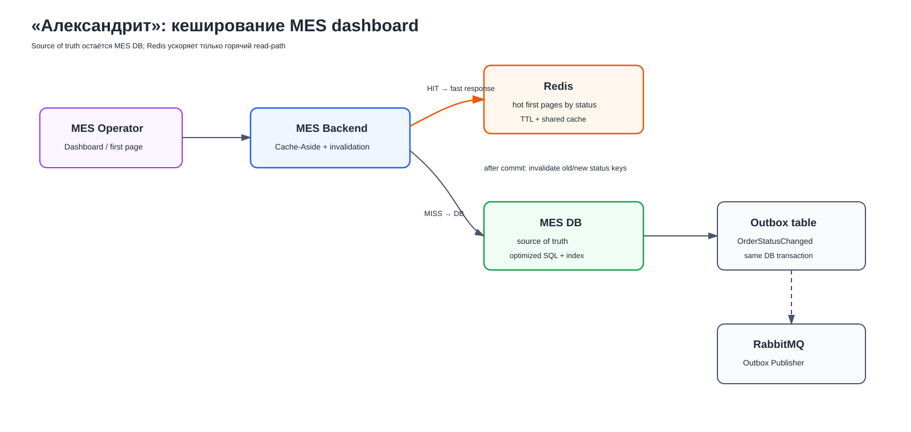
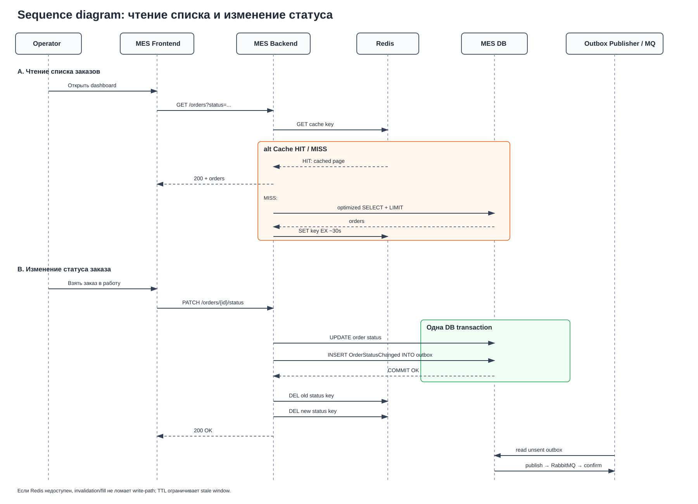

# Архитектурное решение по кешированию

## 1. Анализ и область кеширования

Основная проблема MES, которую имеет смысл решать кешированием, — медленный операторский dashboard.
Операторы чаще всего запрашивают одну и ту же горячую выборку: **самые новые заказы в активном статусе**, прежде всего `MANUFACTURING_APPROVED`.

Фильтрация и пагинация уже были добавлены, но сами по себе не устранили нагрузку на БД. Поэтому решение должно сочетать два шага:

1. оптимизировать SQL и индекс под основной read-path;
2. кешировать наиболее часто читаемую первую страницу.

Основной read-path:

```text
Operator → MES Dashboard → MES Backend
                         → Redis
                         → MES DB при cache miss
```

### Что кешируется

В первой итерации кешируется **первая страница списка заказов по активному статусу**.

### Что не кешируется

| Объект | Почему |
|---|---|
| Pricing result для произвольной 3D-модели | Модели в основном уникальны; низкий ожидаемый hit ratio, риск устаревшей цены |
| Все страницы истории заказов | Это cold data; стоимость поддержки кеша выше пользы |
| POST/PUT/PATCH | Cache используется для read-path, а не как source of truth |
| 3D-файлы целиком | Большие объекты; их хранение — задача Object Storage/CDN, а не Redis dashboard cache |

Pricing ускоряется архитектурой из Task1 — асинхронной очередью и масштабируемыми workers, а не кешированием случайных результатов.

---

## 2. Мотивация

Кеширование должно решить конкретную проблему: повторяющиеся read-запросы операторов создают ненужную нагрузку на MES DB и увеличивают latency первого экрана.

Ожидаемый эффект:

- уменьшение p95/p99 latency dashboard;
- уменьшение количества одинаковых SQL-запросов;
- снижение DB CPU и DB connection usage;
- более стабильная работа MES при росте количества операторов;
- быстрое отображение новых заказов.

Кеш не должен становиться источником истины. Корректность бизнес-процесса остаётся в MES DB.

---

## 3. Предлагаемое решение

Используется **server-side distributed cache на Redis**.



### Основноый вопрос - почему server-side, а не client-side

Browser cache усложнил бы синхронизацию между операторами. Shared Redis позволяет централизованно управлять TTL, invalidation и cache keys и продолжает работать при горизонтальном масштабировании MES.

---

## 4. Выбор паттерна кеширования

| Паттерн | Плюсы | Минусы | Решение |
|---|---|---|---|
| **Cache-Aside** | Простая интеграция, кешируются только востребованные данные, Redis не является обязательным для записи | Нужна явная invalidation | **Выбран** |
| Write-Through | Cache обновляется одновременно с записью | Для агрегированного списка нужно синхронно обновлять много представлений; сложнее consistency | Не выбран |
| Refresh-Ahead | Мало cache misses | Новый заказ может быть невидим до очередного refresh; создаёт лишнюю фоновую нагрузку | Не выбран |

### Почему Cache-Aside

Алгоритм чтения:

1. MES Backend ищет key в Redis.
2. При **HIT** возвращает cached page.
3. При **MISS** читает MES DB.
4. Записывает результат в Redis с TTL.
5. Возвращает данные клиенту.

Если Redis недоступен, MES выполняет fallback в DB. Система становится медленнее, но бизнес-процесс продолжает работать.

---

## 5. Sequence diagram

Диаграмма отражает обе обязательные операции: **чтение списка заказов** и **изменение статуса заказа**.



### 5.1. Чтение списка

```text
GET /orders?status=MANUFACTURING_APPROVED
```

При HIT запрос к DB не выполняется. При MISS выполняется оптимизированный SQL, после чего первая страница помещается в Redis.

### 5.2. Изменение статуса и Transactional Outbox

Sequence согласована с Task1.

В одной DB transaction:

```text
UPDATE order
+
INSERT OrderStatusChanged INTO outbox
```

После `COMMIT` MES инвалидирует cache старого и нового статуса.

Отдельный Outbox Publisher позже отправляет событие в RabbitMQ и после publisher confirm отмечает outbox record как отправленный.

Это предотвращает противоречие:

```text
DB commit success
RabbitMQ publish failed
```

При изменении статуса через incoming RabbitMQ event consumer также обновляет DB в transaction, а после успешного commit инвалидирует связанные cache keys.

---

## 6. Стратегия инвалидации

Выбранная стратегия:

```text
programmatic key invalidation
+
short TTL as safety net
```

### 6.1. Programmatic invalidation

При переходе:

```text
MANUFACTURING_APPROVED
→ MANUFACTURING_STARTED
```

удаляются:

```text
mes:orders:v1:first-page:status:MANUFACTURING_APPROVED
mes:orders:v1:first-page:status:MANUFACTURING_STARTED
```

При создании нового заказа удаляется key соответствующего нового статуса.

Invalidation выполняется **только после успешного DB commit**.

### 6.2. TTL

Начальное значение:

```text
TTL ≈ 30 seconds
```

TTL — не основной механизм актуальности, а страховка на случай, если invalidation не выполнилась.

Точное значение корректируется после измерения:

- cache hit ratio;
- dashboard latency;
- DB load;
- допустимой stale window.

### 6.3. Сравнение стратегий

| Стратегия | Плюсы | Минусы | Вывод |
|---|---|---|---|
| Только TTL | Очень просто | Новые заказы могут быть невидимы до истечения TTL | Недостаточно |
| Programmatic invalidation | Быстрое обновление | Нужно покрыть все write-path | Основной механизм |
| Полная очистка Redis | Просто | Массовые cache misses и потеря пользы кеша | Не использовать |
| Event-driven invalidation | Хорошо масштабируется | Сложнее и зависит от messaging | Возможное развитие |
| **Programmatic + TTL** | Быстро + ограниченная stale window | Немного сложнее | **Выбрано** |

`FLUSHDB` и массовое удаление `mes:orders:*` не используются: изменение одного заказа не должно сбрасывать несвязанные cached pages.

---

## 8. Отказоустойчивость и типовые риски

### Redis недоступен

Используется:

```text
short timeout
→ fallback to MES DB
```

Redis не входит в write-path и не является source of truth.

При длительном отказе можно использовать circuit breaker, чтобы не тратить timeout на каждый запрос.

### Cache stampede

Если популярный key одновременно истёк для большого числа операторов, множество requests могут одновременно обратиться в DB.

Для hot keys при необходимости используется:

- single-flight/distributed lock на короткое время;
- небольшой TTL jitter;
- повторная проверка Redis после получения lock.

Это optimization второго этапа; сначала необходимо измерить реальную конкуренцию.

### Race между read и invalidation

Возможна редкая гонка: старый read начался до DB commit, invalidation уже произошла, а старый request затем записал stale value обратно.

Базовый TTL ограничивает stale window. Если проблема проявится под нагрузкой, можно добавить versioning cached representation или delayed second invalidation. Это не требуется усложнять в первой версии без подтверждённого сценария.

---

## 9. Альтернативные варианты

Дополнительное задание не требует реализовывать несколько решений, если выбор очевиден. Для полноты рассмотрены два варианта:

| Вариант | Плюс | Почему не выбран сейчас |
|---|---|---|
| `order:summary:<order_id>` | Простая invalidation отдельного заказа | Не решает главный запрос: «какие 50 заказов самые новые?» |
| Redis Sorted Set по status + Order Summary | Очень быстрый полностью Redis-based dashboard | Значительно сложнее, повышает риск рассинхронизации и дублирует read model |

Если первая версия Cache-Aside не даст нужного результата, Redis Sorted Set можно рассматривать как развитие, но не как стартовое решение.

---

## 10. Мониторинг кеша

В задании 2 уже задаёт общий monitoring-контур. После появления Redis добавляются:

```text
cache_hits_total
cache_misses_total
cache_hit_ratio
cache_get_duration
cache_errors_total
redis_memory_usage
redis_connections
db_dashboard_query_duration
db_fallback_total
```

Основные признаки эффективности:

- высокий и стабильный hit ratio для hot first page;
- снижение p95/p99 dashboard latency;
- уменьшение количества одинаковых DB queries;
- снижение DB CPU/connections.

Низкий hit ratio может означать слишком короткий TTL, избыточную invalidation или неправильный выбор cache key.

---

## 11. План внедрения

### Этап 1. Baseline и SQL

Измерить:

```text
dashboard p50/p95/p99
DB query latency
DB CPU
DB connections
request rate
```

Проверить `EXPLAIN/EXPLAIN ANALYZE`, composite index и keyset pagination. Cache не должен маскировать плохой SQL.

### Этап 2. Redis и Cache-Aside

- развернуть shared Redis;
- реализовать cache первой страницы активных статусов;
- настроить короткие cache timeouts и fallback.

### Этап 3. Invalidation

- invalidation после DB commit;
- old/new status keys;
- invalidation во всех write-path, включая RabbitMQ consumers;
- TTL как safety net.

### Этап 4. Monitoring и load test

- добавить cache metrics;
- проверить cache hit ratio;
- выполнить нагрузочный тест;
- при необходимости добавить stampede protection;
- откалибровать TTL.

---

## 12. Итоговое решение

Первая версия:

```text
Server-side Redis
+
Cache-Aside
+
hot first-page cache
+
programmatic invalidation after commit
+
TTL ≈ 30s as safety net
+
DB fallback
```

Почему это решение подходит:

1. решает конкретную проблему медленного MES dashboard;
2. минимально меняет существующую систему;
3. снижает read-нагрузку на MES DB;
4. не переносит source of truth из БД в Redis;
5. переживает отказ cache через fallback;
6. согласовано с Transactional Outbox из Task1;
7. может быть реализовано существующей командой без отдельного redesign.

Главный принцип:

> Кеш ускоряет чтение, но корректность заказа не должна зависеть от наличия или состояния кеша.
