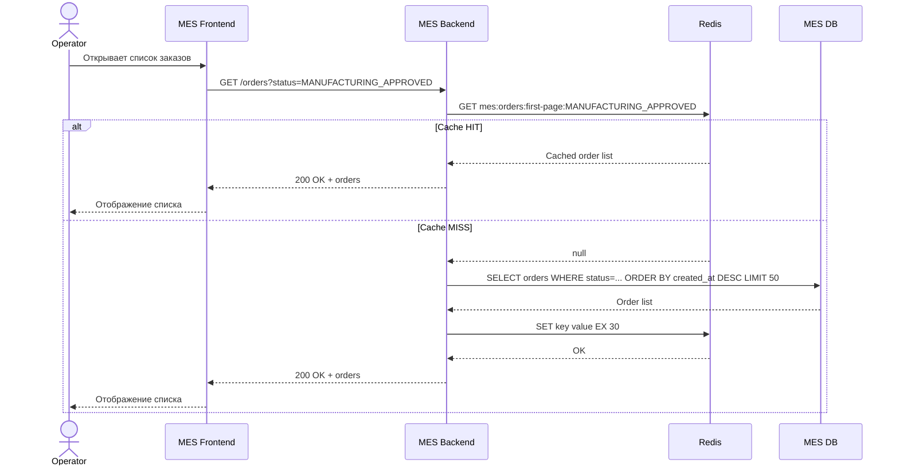
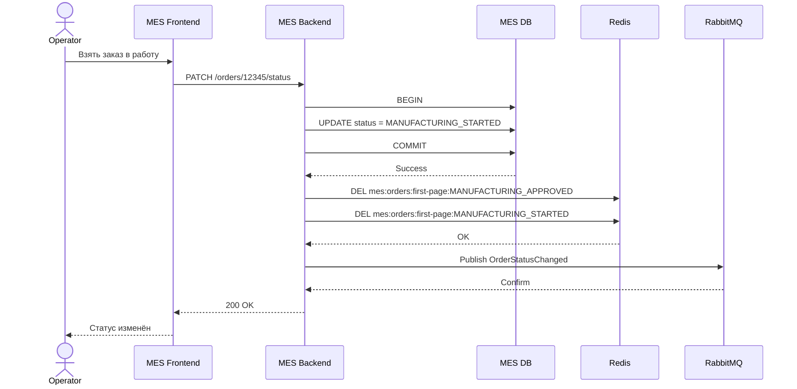

# Архитектурное решение по кешированию

## 1. Анализ текущей ситуации

Основная проблема MES, которую имеет смысл решать с помощью кеширования, — медленная работа dashboard операторов.

На первой странице MES отображается список заказов в работе с фильтрацией по статусам.

Ранее система выводила все заказы. После появления проблем с производительностью команда добавила:

- фильтрацию;
- пагинацию.

Однако существенного улучшения это не дало.

Операторам особенно важно быстро видеть **самые новые заказы**, потому что от этого зависит, кто первым возьмёт заказ в работу и получит вознаграждение.

Следовательно, наиболее горячий read-path системы выглядит примерно так:

```text
Operator
   ↓
MES Dashboard
   ↓
GET /orders?status=MANUFACTURING_APPROVED
   ↓
MES Backend
   ↓
MES DB
   ↓
ORDER BY created_at DESC
   ↓
первая страница заказов
```

При росте количества заказов этот запрос выполняется всё чаще и работает с постоянно растущей таблицей.

Кеширование имеет смысл применить именно к этой части системы.

---

# 2. Что предлагается кешировать

Предлагается кешировать:

## Первая страница списка заказов по статусу

Например:

```text
MANUFACTURING_APPROVED
MANUFACTURING_STARTED
MANUFACTURING_COMPLETED
PACKAGING
```

Особенно критична первая страница:

```text
MANUFACTURING_APPROVED
```

поскольку именно здесь операторы ищут новые доступные заказы.

Пример cache key:

```text
mes:orders:first-page:MANUFACTURING_APPROVED
```

или:

```text
mes:orders:list:status:MANUFACTURING_APPROVED:limit:50
```

Значение:

```json
{
  "orders": [
    {
      "id": "12345",
      "status": "MANUFACTURING_APPROVED",
      "created_at": "2026-09-11T12:00:00Z",
      "title": "Ring model"
    }
  ],
  "cached_at": "2026-09-11T12:00:03Z"
}
```

---

# 3. Что не предлагается кешировать

## 3.1. Расчёт стоимости 3D-модели

Сам расчёт стоимости может занимать от 2–3 до 30 минут.

На первый взгляд его хочется закешировать, однако стоимость зависит от конкретной 3D-модели и параметров изделия.

Если большинство загружаемых моделей уникальны, cache hit rate будет низким.

Кроме того, изменение:

- алгоритма расчёта;
- цены материалов;
- производственных коэффициентов;

может сделать старый результат некорректным.

Поэтому основной проблемой расчёта стоимости является не отсутствие кеша, а необходимость:

```text
асинхронной обработки
+
очереди
+
масштабируемых workers
```

---

## 3.2. Весь список заказов

Нет необходимости складывать в Redis все страницы всех заказов.

Старые страницы используются значительно реже.

В первую очередь кешируется **hot data**:

```text
первая страница
+
активные статусы
```

Остальные страницы продолжают читаться из БД.

Для них следует использовать оптимизированный SQL и keyset pagination.

---

## 3.3. Запросы изменения статуса

Операции:

```text
POST
PUT
PATCH
```

не кешируются.

Кеш используется только для ускорения чтения.

---

# 4. Мотивация

Кеширование должно решить несколько конкретных проблем.

## Снижение latency dashboard

Самые часто используемые данные будут находиться в памяти.

Вместо:

```text
MES API
   ↓
DB
   ↓
filter
   ↓
sort
   ↓
result
```

для большинства запросов получится:

```text
MES API
   ↓
Redis
   ↓
result
```

---

## Снижение нагрузки на MES DB

Если 30 операторов постоянно обновляют первую страницу:

```text
30 операторов
×
много refresh
=
много одинаковых SQL-запросов
```

без cache БД выполняет практически один и тот же запрос снова и снова.

После кеширования:

```text
первый запрос
→ DB

следующие запросы
→ Redis
```

---

## Улучшение масштабируемости

Количество операторов и заказов может расти, но количество запросов к основной БД увеличивается значительно медленнее.

---

## Повышение стабильности MES

Снижение нагрузки на DB уменьшает вероятность:

- медленных запросов;
- исчерпания connections;
- роста API latency;
- деградации dashboard.

---

## Улучшение пользовательского опыта операторов

Первая страница должна открываться практически мгновенно.

Это особенно важно, поскольку операторы конкурируют за новые заказы.

---

# 5. Предлагаемое решение

Предлагается внедрить **server-side caching**.

Архитектура:

```text
MES Frontend
      |
      v
MES Backend
      |
      +---------+
      |         |
      v         v
    Redis     MES DB
```

---

# 6. Почему server-side cache

Клиентское кеширование для этого сценария использовать как основной механизм не следует.

Причина — список заказов является:

- динамическим;
- общим для нескольких операторов;
- быстро изменяющимся;
- чувствительным к freshness.

Если кешировать данные в браузере:

```text
Operator A → старая версия
Operator B → новая версия
Operator C → ещё одна версия
```

будет сложно обеспечить единое представление актуальных заказов.

Это особенно плохо, потому что новый заказ должен одновременно появляться у всех операторов.

Server-side cache позволяет централизованно контролировать:

- TTL;
- invalidation;
- структуру ключей;
- freshness.

---

# 7. Технология кеша

Предлагается использовать Redis.

Redis подходит, поскольку:

- данные хранятся в памяти;
- низкая latency;
- поддерживает TTL;
- поддерживает atomic operations;
- хорошо подходит для Cache-Aside;
- может использоваться несколькими instances MES одновременно;
- позволяет централизованно инвалидировать данные.

Кеш должен быть отдельным инфраструктурным компонентом и не размещаться в памяти одного MES instance.

Иначе при горизонтальном масштабировании получится:

```text
MES-1 → cache A
MES-2 → cache B
MES-3 → cache C
```

с разным состоянием.

Redis даёт единый shared cache:

```text
       MES-1
         |
MES-2 → Redis
         |
       MES-3
```

---

# 8. Выбор паттерна кеширования

Рассмотрены три основных паттерна:

| Паттерн | Принцип | Плюсы | Минусы | Применимость |
|---|---|---|---|---|
| Cache-Aside | Приложение сначала проверяет cache, при miss читает DB и кладёт результат в cache | Просто внедрить, cache содержит только востребованные данные, отказ Redis не блокирует основной процесс | Нужно самостоятельно решать invalidation | **Выбран** |
| Write-Through | Любое изменение одновременно записывается в DB и cache | Cache почти всегда актуален | Сложнее транзакционность, необходимо обновлять все варианты списков и фильтров | Не выбран |
| Refresh-Ahead | Cache обновляется заранее до истечения TTL | Минимальная вероятность cache miss | Дополнительная нагрузка, сложнее прогнозировать hot keys, возможна stale data | Не выбран |

---

# 9. Почему Cache-Aside

Для MES предлагается использовать **Cache-Aside**.

Алгоритм чтения:

```text
1. MES получает запрос списка заказов.

2. Проверяет Redis.

3. Cache HIT:
   возвращает данные.

4. Cache MISS:
   читает DB.

5. Записывает результат в Redis.

6. Возвращает результат клиенту.
```

Основное преимущество — минимальное вмешательство в существующую архитектуру.

Если Redis временно недоступен:

```text
Redis unavailable
       ↓
MES читает DB
```

Система становится медленнее, но продолжает работать.

---

# 10. Почему не Write-Through

Write-Through хорошо работает, когда cached representation напрямую соответствует изменяемому объекту.

Например:

```text
order:12345
```

Но в нашем случае кешируется агрегированный список:

```text
orders:
status=MANUFACTURING_APPROVED
sort=created_at DESC
page=first
```

При изменении одного заказа пришлось бы корректно обновить сразу несколько cache representations.

Например:

```text
MANUFACTURING_APPROVED
MANUFACTURING_STARTED
all orders
different filters
different pages
```

Это значительно усложняет код.

Также появляется проблема согласованности:

```text
DB update success
Redis update failed
```

или наоборот.

Поэтому безопаснее после изменения данных **инвалидировать** кеш, чем пытаться синхронно изменить его содержимое.

---

# 11. Почему не Refresh-Ahead

Refresh-Ahead периодически обновляет cache до истечения TTL.

Для некоторых справочных данных это хорошее решение.

Но в MES новые заказы могут появляться в любой момент.

Например:

```text
12:00:00 cache refreshed
12:00:01 появился новый заказ
12:00:30 следующий refresh
```

В течение 29 секунд оператор не увидит новый заказ.

Так как между операторами существует конкуренция за новые заказы, подобная задержка нежелательна.

Поэтому refresh по таймеру не должен быть основным способом поддержания актуальности.

---

# 12. Операция чтения списка заказов

## Sequence diagram



---

# 13. Изменение статуса заказа

Критически важно сначала изменить состояние в основной БД.

Redis не является source of truth.

Source of truth:

```text
MES DB
```

Алгоритм:

```text
1. Пользователь меняет статус.

2. MES обновляет DB.

3. Transaction успешно COMMIT.

4. После COMMIT MES инвалидирует связанные cache keys.

5. Следующее чтение выполнит Cache Miss.

6. MES получит актуальные данные из DB.

7. Cache заполнится новым значением.
```

---

# 14. Sequence diagram изменения статуса



---

# 15. Почему cache инвалидируется после DB commit

Нельзя делать:

```text
invalidate cache
        ↓
DB update
```

потому что DB update может завершиться ошибкой.

Правильный порядок:

```text
DB COMMIT
    ↓
cache invalidation
```

DB остаётся единственным source of truth.

---

# 16. Изменения статуса из других систем

Статусы заказа изменяются не только непосредственно оператором MES.

Например:

```text
MANUFACTURING_APPROVED
```

устанавливается CRM.

Если MES получает изменение через RabbitMQ:

```text
CRM
 ↓
RabbitMQ
 ↓
MES consumer
 ↓
MES DB
```

после успешного commit consumer также должен инвалидировать соответствующий cache key.

То есть invalidation должна выполняться **во всех местах, которые изменяют данные, участвующие в cached query**.

---

# 17. Стратегия инвалидации

Для данного решения предлагается комбинированная стратегия:

```text
PROGRAMMATIC INVALIDATION
+
TTL
```

Основной механизм:

```text
программная инвалидация по ключу
```

Резервный механизм:

```text
короткий TTL
```

---

# 18. Программная инвалидация

При создании нового заказа:

```text
DEL cache:<новый status>
```

При изменении:

```text
OLD_STATUS → NEW_STATUS
```

удаляются два ключа:

```text
cache:OLD_STATUS
cache:NEW_STATUS
```

Например:

```text
MANUFACTURING_APPROVED
        ↓
MANUFACTURING_STARTED
```

инвалидируются:

```text
mes:orders:first-page:MANUFACTURING_APPROVED

mes:orders:first-page:MANUFACTURING_STARTED
```

---

# 19. TTL

Даже при программной инвалидации каждому ключу устанавливается TTL.

Первоначально предлагается:

```text
TTL = 30 seconds
```

TTL не является основным механизмом freshness.

Он выступает страховкой.

Например:

```text
DB update
   ↓
Redis invalidation failed
```

Без TTL данные могли бы остаться устаревшими неопределённо долго.

С TTL максимальное время существования такого значения ограничено.

Конкретное значение необходимо уточнить после измерения:

```text
cache hit ratio
DB load
dashboard latency
```

---

# 20. Сравнение стратегий инвалидации

| Стратегия | Плюсы | Минусы | Решение |
|---|---|---|---|
| Только TTL | Очень просто | После появления нового заказа пользователь может видеть старый список до окончания TTL | Не подходит как основная |
| Программная по ключу | Почти моментальное обновление | Нужно корректно инвалидировать cache во всех write-path | **Основная стратегия** |
| Полная очистка cache | Просто реализовать | Удаляет несвязанные данные и создаёт много cache miss | Не подходит |
| Event-driven invalidation | Хорошо масштабируется между сервисами | Сложнее реализация, зависит от messaging | Возможное развитие |
| Programmatic + TTL | Быстрое обновление + защита от ошибок invalidation | Немного сложнее простого TTL | **Выбранный вариант** |

---

# 21. Почему нельзя использовать только TTL

Предположим:

```text
TTL = 60 секунд
```

В 12:00:00 сформировался cache.

В 12:00:01 появился новый заказ.

Если invalidation нет:

```text
12:00:01 → старый список
12:00:20 → старый список
12:00:40 → старый список
12:00:59 → старый список
12:01:00 → cache expired
```

Оператор может увидеть заказ почти на минуту позже коллеги или вообще не увидеть его при нужном refresh.

Для данной бизнес-модели это нежелательно.

---

# 22. Почему нельзя очищать весь Redis

При каждом изменении можно было бы выполнять:

```text
FLUSHDB
```

или удалять все `mes:orders:*`.

Это технически просто, но уничтожает преимущества кеширования.

Одно изменение заказа привело бы к cache miss у всех операторов.

Поэтому требуется точечная invalidation.

---

# 23. Cache key design

Пример:

```text
mes:orders:v1:first-page:status:MANUFACTURING_APPROVED
```

Структура:

```text
application
resource
cache version
page type
filter
```

Версия:

```text
v1
```

позволяет безопасно изменить формат cached value.

При несовместимом изменении можно перейти:

```text
v1 → v2
```

без массового удаления старых ключей.

---

# 24. Что хранить в cached value

В Redis следует хранить только поля, необходимые dashboard.

Например:

```text
order_id
created_at
status
product_type
short_description
priority
```

Не нужно помещать:

- содержимое 3D-модели;
- большие blobs;
- лишние внутренние данные;
- платёжные данные.

Cache должен оставаться небольшим.

---

# 25. Предотвращение Cache Stampede

Возможна ситуация:

```text
TTL expired
    ↓
100 operators
одновременно делают request
    ↓
100 Cache Miss
    ↓
100 одинаковых запросов в DB
```

Для предотвращения cache stampede можно использовать distributed lock.

Например:

```text
SET lock:<cache-key> NX EX 5
```

Первый request:

```text
получает lock
→ читает DB
→ заполняет cache
```

Остальные:

```text
коротко ждут
→ повторно читают Redis
```

Для TTL также можно добавить небольшой jitter, если будет кешироваться больше ключей:

```text
TTL = 30 ± несколько секунд
```

---

# 26. Cache Penetration

Если клиент постоянно спрашивает данные, которых нет, запросы могут каждый раз уходить в DB.

Для списка заказов риск небольшой.

Для получения отдельного заказа:

```text
GET /orders/{id}
```

при необходимости можно использовать negative caching:

```text
order:not-found:<id>
TTL = несколько секунд
```

Но в первую итерацию это не является приоритетом.

---

# 27. Отказ Redis

Cache не является критическим source of truth.

При недоступности Redis:

```text
MES Backend
     ↓
Redis ERROR
     ↓
fallback
     ↓
MES DB
```

Пользователь получит ответ медленнее, но бизнес-процесс продолжит работать.

Необходимо реализовать:

```text
short cache timeout
+
fallback to DB
+
circuit breaker при длительной проблеме
```

Не следует ждать Redis десятки секунд.

---

# 28. Метрики кеширования

После внедрения необходимо измерять:

```text
cache_hits_total
cache_misses_total
cache_hit_ratio

cache_get_duration
cache_set_duration

cache_errors_total

redis_memory_usage
redis_connections

db_dashboard_query_duration
```

Основная метрика эффективности:

```text
cache_hit_ratio =
hits / (hits + misses)
```

---

# 29. Целевые эффекты

Для cached dashboard query необходимо ожидать:

```text
уменьшение p95 latency

уменьшение количества одинаковых DB queries

снижение DB CPU

снижение DB connection usage
```

Конкретные SLO следует устанавливать после baseline measurements.

---

# 30. Взаимодействие с мониторингом

В Task2 уже предусмотрен мониторинг MES.

После внедрения кеша необходимо добавить отдельный dashboard:

```text
MES Cache
```

Он должен показывать:

```text
hit ratio
miss ratio
Redis latency
Redis errors
memory usage
DB fallback rate
```

Если:

```text
cache hit ratio резко упал
```

это может означать:

- ошибку invalidation;
- слишком маленький TTL;
- неправильную структуру ключей;
- изменение access pattern.

---

# 31. Вариант 2 — кеширование отдельных Order Summary

Дополнительно можно рассмотреть второй подход.

Вместо кеширования первой страницы хранить:

```text
order:summary:<order_id>
```

Например:

```text
order:summary:12345
```

### Плюсы

- простая invalidation;
- каждый объект обновляется независимо;
- высокий reuse при частом открытии одного заказа.

### Минусы

Главная проблема dashboard остаётся:

```text
какие order_id являются 50 самыми новыми?
```

Чтобы получить список ID, всё равно требуется запрос к DB или отдельная sorted structure.

---

# 32. Вариант 3 — Redis Sorted Set

Более сложное решение:

для каждого status хранить Sorted Set:

```text
orders:MANUFACTURING_APPROVED
```

где:

```text
score = created_at timestamp
member = order_id
```

Например:

```text
ZADD orders:MANUFACTURING_APPROVED
     1757592000
     12345
```

Получение новых:

```text
ZREVRANGE
orders:MANUFACTURING_APPROVED
0 49
```

После этого order summaries можно получить из Redis.

---

# 33. Сравнение двух основных вариантов

| Характеристика | Cache первой страницы | Redis Sorted Set + Order Cache |
|---|---|---|
| Сложность | Низкая | Высокая |
| Внедрение | Быстрое | Существенная доработка |
| Invalidation | Простая | Нужно поддерживать структуру |
| Freshness | Высокая при invalidation | Очень высокая |
| DB load | Значительно снижается | Может снизиться ещё сильнее |
| Риск рассинхронизации | Низкий | Выше |
| Подходит существующей команде | Да | Потребует больше разработки |
| Хорош для первой итерации | **Да** | Нет |

---

# 34. Итоговый выбор

В первой версии предлагается:

```text
Server-side Redis Cache
+
Cache-Aside
+
cache первой страницы активных заказов
+
programmatic key invalidation
+
TTL 30 seconds как safety mechanism
```

Почему это решение:

1. Решает конкретную проблему медленного dashboard.
2. Минимально меняет существующее приложение.
3. Снижает нагрузку на MES DB.
4. Не переносит source of truth из PostgreSQL в Redis.
5. Позволяет продолжить работу при отказе cache.
6. Обеспечивает практически мгновенную видимость новых заказов при корректной invalidation.
7. Реализуется существующей командой без крупного redesign.

Более сложная схема с Redis Sorted Sets может рассматриваться только после измерения эффективности первой версии.

---

# 35. План внедрения

### Этап 1

Измерить baseline:

```text
MES dashboard p50/p95/p99
DB query latency
DB CPU
DB connections
request rate
```

### Этап 2

Оптимизировать SQL и убедиться в наличии подходящего composite index.

Кеширование не должно использоваться как замена исправлению плохого SQL.

### Этап 3

Развернуть Redis.

### Этап 4

Реализовать Cache-Aside для первой страницы активных заказов.

### Этап 5

Реализовать invalidation после DB commit.

### Этап 6

Подключить invalidation для всех consumers RabbitMQ, изменяющих order data.

### Этап 7

Добавить TTL.

### Этап 8

Добавить protection от cache stampede.

### Этап 9

Добавить metrics.

### Этап 10

Провести нагрузочное тестирование.

---

# 36. Ожидаемый результат

После внедрения обычный read-path будет выглядеть:

```text
Operator
    ↓
MES
    ↓
Redis
    ↓
<несколько миллисекунд>
    ↓
Orders
```

DB используется только при:

```text
cache miss
```

или для редко используемых страниц.

При изменении заказа:

```text
DB update
   ↓
COMMIT
   ↓
invalidate old/new status cache
   ↓
следующий request
   ↓
fresh data from DB
   ↓
new cache
```

Таким образом кеширование ускоряет наиболее частый read-path, но не становится источником истины и не создаёт риск потери заказа.

Главный принцип решения:

> Кеш должен ускорять MES, но корректность бизнес-процесса не должна зависеть от наличия или состояния кеша.